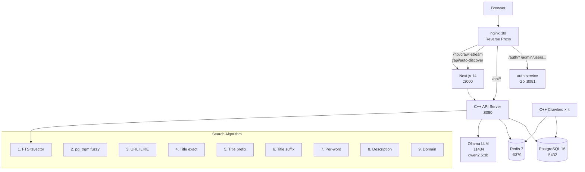

# AngkorSearch v2.3

> Cambodia's open-source search engine — built to index, search, and surface **Khmer & English** content from across the web.

**Made with love by [Ing Muyleang](https://muyleanging.com) · [KhmerStack](https://khmerstack.muyleanging.com)**

---

## What is AngkorSearch?

AngkorSearch is a fully self-hosted, open-source search engine built from scratch for Cambodia. It crawls websites across the entire web (with priority on Cambodian and Khmer-language sites), indexes content using PostgreSQL full-text search + trigram fuzzy matching, and serves results through a C++ REST API — with a modern Next.js frontend.

No external search APIs. No Google. No Bing. 100% self-hosted.

---

## Features

- **9-strategy fuzzy search** — FTS + trigram + URL + prefix/suffix + per-word + content + domain matching
- **Auto Web Discovery** — when no results found, auto-discovers related URLs (GitHub, personal sites, npm, LinkedIn) and crawls them live
- **Direct Force Crawl** — instantly fetch and index any URL without waiting in queue
- **Multiple content tabs** — All, News, Images, Videos, Dev & Tech, Saved, History
- **AI Answer overview** — powered by local Ollama LLM (no cloud, no API keys)
- **Knowledge Panel** — right-side info card for top results
- **Dark / Light mode** — persisted via localStorage
- **Autocomplete suggestions** — as you type
- **Bookmarks & Search History** — saved per user
- **Admin Dashboard** — seed domains, crawl queue, system monitoring, top searches
- **Multi-worker crawler** — 4 concurrent C++ crawlers, up to 100,000 pages each
- **Open-domain crawling** — crawls any public website (blocks walled gardens: Facebook, Instagram, TikTok, Twitter)
- **Responsive UI** — works on mobile, tablet, and desktop

---

## Architecture

### High-Level Overview

```
                        ┌──────────────────────────────────────────┐
                        │              User's Browser               │
                        └──────────────────┬───────────────────────┘
                                           │ HTTP :80
                        ┌──────────────────▼───────────────────────┐
                        │                nginx                      │
                        │          Reverse Proxy :80                │
                        └──────┬──────────────┬──────────────┬─────┘
                               │              │              │
              /auth/* /admin/  │   /api/*     │     /*       │
              (users,roles...) │  C++ API     │  Next.js     │
                               │              │  Frontend    │
                 ┌─────────────▼──┐  ┌────────▼──┐  ┌───────▼──────┐
                 │  auth service  │  │ C++ API   │  │  Next.js 14  │
                 │  Go :8081      │  │ :8080     │  │  :3000       │
                 └────────────────┘  └─────┬─────┘  └──────┬───────┘
                                           │               │
                              ┌────────────┼───────────────┘
                              │            │
               ┌──────────────▼──┐  ┌──────▼───────────────┐
               │   PostgreSQL 16  │  │      Redis 7          │
               │   :5432          │  │      :6379            │
               │                  │  │                       │
               │  pages           │  │  visited URL set      │
               │  crawl_queue     │  │  search result cache  │
               │  seeds           │  │  crawl queue signal   │
               │  users           │  └───────────────────────┘
               │  bookmarks       │
               │  search_history  │         ┌────────────────┐
               │  images/videos   │         │   Ollama LLM   │
               │  news/github     │         │   :11434       │
               └──────────────────┘         │   qwen2.5:3b   │
                                            └────────────────┘

               ┌───────────────────────────────────────────────┐
               │              C++ Crawlers × 4                 │
               │  crawler_1  crawler_2  crawler_3  crawler_4   │
               │                                               │
               │  1. Pull URL from crawl_queue (priority ASC)  │
               │  2. Fetch with libcurl                        │
               │  3. Parse HTML (Gumbo parser)                 │
               │  4. Save to pages table (PostgreSQL)          │
               │  5. Enqueue outbound links                    │
               │  6. Track visited URLs in Redis SET           │
               └───────────────────────────────────────────────┘
```

### Data Flow: Search Request

```
User types query
      │
      ▼
Next.js frontend
  useSearch hook → GET /api/search?q=muyleang
      │
      ▼
nginx → C++ API :8080  /search endpoint
      │
      ▼
  Query Expansion (9 strategies)
  ┌─────────────────────────────────────────────────────────┐
  │  1. FTS  — tsvector @@ plainto_tsquery('simple', q)     │
  │  2. Trigram — title % q  (pg_trgm fuzzy match)          │
  │  3. URL — url ILIKE '%q%'                               │
  │  4. Title exact — title ILIKE '%q%'                     │
  │  5. Title prefix — title ILIKE '%first65%'              │
  │  6. Title suffix — title ILIKE '%last60%'               │
  │  7. Per-word — title ILIKE '%word2%'                    │
  │  8. Description — description ILIKE '%q%'               │
  │  9. Domain — domain ILIKE '%q%'                         │
  └─────────────────────────────────────────────────────────┘
      │
      ▼
  Ranking Score = FTS*3.0 + URL_match*1.5 + trigram*1.2
                + title_match*0.8 + description*0.2
      │
      ▼
  Check Redis cache → return if hit
      │
      ▼
JSON response → Next.js → SearchResults component
      │
      ▼ (if 0 results)
WebDiscovery component (SSE)
  → /api/auto-discover?q=muyleang
  → guesses URLs: github.com/muyleang, muyleang.com,
                  muyleang.github.io, muyleang.dev, ...
  → calls /admin/crawl-now for each candidate
  → streams live terminal output to user
  → auto-refreshes search when pages found
```

### Data Flow: Force Crawl (Admin)

```
Admin enters URL in dashboard
      │
      ▼
POST /api/crawl-stream?url=https://example.com
      │
      ▼
nginx → Next.js API route (SSE stream)
  → POST /admin/crawl-now  (C++ API)
        │
        ├── fetch URL with libcurl (timeout 12s)
        ├── parse HTML: title, meta description, body text
        ├── detect language (Khmer Unicode range U+1780–U+17FF)
        ├── INSERT INTO pages ... ON CONFLICT DO UPDATE
        ├── mark crawled in crawl_queue
        └── SADD visited in Redis
      │
      ▼
SSE stream → shows progress live in admin UI
  → "Fetching page content..."
  → "Indexed: <title> (N words)"
```

### Mermaid Architecture Diagram



---

## Tech Stack

| Layer | Technology |
|-------|-----------|
| Frontend | Next.js 14 (App Router), TypeScript, Tailwind CSS, Framer Motion |
| API Server | C++20, libpq, hiredis, libcurl, nlohmann/json |
| Crawler | C++20, libcurl, Gumbo HTML parser, libpq, hiredis |
| Database | PostgreSQL 16 with `pg_trgm`, `unaccent`, full-text search |
| Cache / Queue | Redis 7 |
| AI Answers | Ollama (local LLM — qwen2.5:3b by default) |
| Auth | Go service with JWT + session cookies |
| Proxy | nginx Alpine |
| Container | Docker + Docker Compose |

---

## Quick Start

### Requirements

- Docker Desktop (Mac/Windows) or Docker + Docker Compose v2 (Linux)
- 4 GB RAM minimum (8 GB recommended for Ollama LLM)

### Run

```bash
# Clone
git clone https://github.com/MuyleangIng/angkorsearch
cd angkorsearch

# Start everything (builds all images, ~3-5 min first time)
docker compose up -d --build

# Open in browser
open http://localhost
```

First boot takes 2–3 minutes. The crawler starts indexing seed domains automatically.

### Stop

```bash
# Stop services (keeps data)
docker compose down

# Stop and wipe all data (fresh start)
docker compose down -v
```

---

## Docker Services

| Service | Description | Port |
|---------|-------------|------|
| `nginx` | Reverse proxy — routes all traffic | 80 |
| `frontend` | Next.js 14 UI (standalone build) | 3000 |
| `api` | C++ REST API server | 8080 |
| `auth` | Go authentication service | 8081 |
| `crawler_1–4` | 4 parallel C++ web crawlers | — |
| `postgres` | PostgreSQL 16 database | 5432 |
| `redis` | Redis 7 cache + queue | 6379 |
| `ollama` | Local LLM inference server | 11434 |
| `ollama-init` | One-shot model downloader | — |

---

## API Endpoints

### Search & Discovery

| Method | Endpoint | Description |
|--------|----------|-------------|
| `GET` | `/search?q=angkor&type=web&page=1&lang=km` | Full-text + fuzzy search |
| `GET` | `/suggest?q=cambo` | Autocomplete suggestions |
| `GET` | `/ai/answer?q=what+is+angkor+wat` | AI-generated answer (Ollama) |
| `GET` | `/live?since=10` | Recently crawled pages |
| `GET` | `/stats` | Index statistics |
| `GET` | `/health` | Health check |

**Search types:** `web`, `news`, `image`, `video`, `github`
**Lang filter:** `km` (Khmer), `en` (English), or omit for all

### Bookmarks & History

| Method | Endpoint | Description |
|--------|----------|-------------|
| `POST` | `/bookmark` | Save a bookmark |
| `GET` | `/bookmarks?user_id=1` | Get saved bookmarks |
| `GET` | `/history?user_id=1` | Get search history |
| `DELETE` | `/history?user_id=1` | Clear search history |

### Admin

| Method | Endpoint | Description |
|--------|----------|-------------|
| `GET` | `/admin/stats` | Full index + crawl statistics |
| `GET` | `/admin/seeds` | List seed domains |
| `POST` | `/admin/seeds` | Add new seed domain |
| `PATCH` | `/admin/seeds` | Update seed priority or status |
| `DELETE` | `/admin/seeds?id=1` | Delete a seed |
| `POST` | `/admin/queue` | Force-add URL to crawl queue (P1) |
| `POST` | `/admin/crawl-now` | Directly fetch + index a URL immediately |
| `GET` | `/admin/system` | System resource metrics |

### Next.js API Routes (SSE)

| Method | Endpoint | Description |
|--------|----------|-------------|
| `GET` | `/api/crawl-stream?url=...` | Force-crawl a URL, stream progress via SSE |
| `GET` | `/api/auto-discover?q=...` | Auto-discover related URLs for a query, stream results via SSE |

---

## Search Algorithm

AngkorSearch uses 9 parallel strategies to find results, then combines them with a ranking score:

```
Score = FTS_rank × 3.0          (full-text search — most important)
      + URL_match × 1.5          (query appears in URL)
      + trigram_similarity × 1.2 (fuzzy match via pg_trgm)
      + title_match × 0.8        (query in title)
      + description_match × 0.2  (query in description)
```

**Example — searching "muyleang":**

| Strategy | Match example |
|----------|--------------|
| FTS | documents with "muyleang" in indexed tsvector |
| Trigram | "muyleanging.com" has ~33% trigram overlap with "muyleang" |
| URL ILIKE | `url LIKE '%muyleang%'` — catches muyleanging.com, github.com/muyleanging |
| Title prefix | searches `%muylea%` (65% of first word) |
| Title suffix | searches `%eang%` (last 60%) |
| Per-word | if multi-word query, searches each word separately |
| Description | `description LIKE '%muyleang%'` |
| Domain | `domain LIKE '%muyleang%'` |

This means a search for "leang" can still find "muyleanging.com" because the URL contains "leang".

---

## Auto Web Discovery

When a search returns 0 results, the WebDiscovery component activates automatically:

1. Sends the query to `/api/auto-discover?q=...`
2. Generates candidate URLs from the query words:
   - `github.com/{slug}` — GitHub profile
   - `{slug}.com` — personal/project website
   - `{slug}.github.io` — GitHub Pages
   - `{slug}.dev` — developer domain
   - `npmjs.com/package/{slug}` — npm package
   - `linkedin.com/in/{slug}` — LinkedIn profile
3. Calls `/admin/crawl-now` for each candidate
4. Streams live progress in a terminal-style UI
5. Auto-refreshes search results when new pages are indexed

**Note:** Facebook, Instagram, TikTok, Twitter, and other walled gardens cannot be crawled — they block all bots. Even Google does not index private social media content.

---

## Admin Dashboard

Access at **http://localhost/admin**

| Tab | Features |
|-----|---------|
| **Overview** | Index stats, top domains, content breakdown, crawl progress, recently crawled table |
| **Seed Domains** | Add/remove seeds, set priority, block/allow toggle |
| **Crawl Queue** | Force-add any URL at Priority 1, domain progress bars, queue stats |
| **System** | RAM, Disk, Redis memory gauges, pages/hour, API uptime, DB table sizes |
| **Searches** | Top search queries bar chart |

---

## Project Structure

```
angkorsearch/
├── docker-compose.yml              orchestrates all services
│
├── angkorsearch-web/               Next.js 14 frontend (TypeScript)
│   ├── app/
│   │   ├── page.tsx                Homepage — search + discover feed
│   │   ├── search/page.tsx         Search results + Knowledge Panel
│   │   ├── admin/page.tsx          Admin dashboard (5 tabs)
│   │   ├── about/page.tsx          About page + contributors
│   │   └── api/
│   │       ├── crawl-stream/       SSE: force-crawl any URL live
│   │       │   └── route.ts
│   │       └── auto-discover/      SSE: auto-discover + crawl related URLs
│   │           └── route.ts
│   ├── components/
│   │   ├── layout/                 Header, Footer, Sidebar
│   │   ├── search/                 SearchBox, SearchTabs, SearchResults
│   │   │                           └── WebDiscovery (auto-discovery panel)
│   │   ├── results/                WebResult, NewsResult, ImageResult,
│   │   │                               VideoResult, GithubResult
│   │   └── widgets/                AIOverview, KnowledgePanel, TopResult,
│   │                                   PeopleAlsoAsk, StatsBar, DiscoverFeed
│   ├── hooks/                      useSearch, useSuggest, useBookmark
│   ├── lib/                        api.ts, constants.ts, utils.ts, theme.tsx
│   └── Dockerfile                  Multi-stage Node 20 Alpine -> standalone
│
├── api/
│   ├── api_server.cpp              C++ HTTP API server
│   │                               Endpoints: search, suggest, ai/answer,
│   │                               live, stats, bookmarks, history,
│   │                               admin/stats, admin/seeds, admin/queue,
│   │                               admin/crawl-now, admin/system
│   └── Dockerfile
│
├── crawler/
│   ├── crawler.cpp                 C++ multi-worker web crawler
│   │                               libcurl + Gumbo HTML parser + libpq
│   │                               Crawls all public domains (blocks walled gardens)
│   │                               Priority: Cambodian=3, GitHub=4, others=7
│   └── Dockerfile
│
├── auth/
│   └── ...                         Go auth service (JWT + sessions)
│
├── postgres/
│   └── init.sql                    Database schema + indexes + views
│                                   Tables: pages, crawl_queue, seeds, users,
│                                   bookmarks, search_history, images, videos,
│                                   news, github_repos, crawler_live
│
├── nginx/
│   └── nginx.conf                  Reverse proxy config
│                                   SSE routes: /api/crawl-stream,
│                                   /api/auto-discover -> Next.js
│                                   /api/* -> C++ API
│                                   /auth/* -> Go auth
│
└── data/
    └── dict/
        └── khmer_dict.txt          Khmer word segmentation dictionary
```

---

## Database Schema

### Key Tables

```sql
-- Indexed web pages
pages (
    id          SERIAL PRIMARY KEY,
    url         TEXT UNIQUE,
    domain      TEXT,
    title       TEXT,
    description TEXT,
    content     TEXT,
    type        TEXT,   -- 'web' | 'news' | 'image' | 'video' | 'github'
    lang        TEXT,   -- 'km' | 'en'
    score       FLOAT,
    indexed_at  TIMESTAMP,
    tsv         TSVECTOR  -- FTS index
)

-- Crawl queue with priority
crawl_queue (
    id        SERIAL PRIMARY KEY,
    url       TEXT UNIQUE,
    domain    TEXT,
    priority  INT,   -- 1=force, 2=high, 5=normal, 10=low
    crawled   BOOLEAN DEFAULT FALSE,
    added_at  TIMESTAMP
)

-- Seed domains
seeds (
    id       SERIAL PRIMARY KEY,
    url      TEXT,
    domain   TEXT,
    type     TEXT,
    priority INT,
    active   BOOLEAN
)
```

### Useful Queries

```bash
# Connect to PostgreSQL
docker compose exec postgres psql -U angkor -d angkorsearch
```

```sql
-- Total pages indexed
SELECT COUNT(*) FROM pages;

-- By content type
SELECT type, COUNT(*) FROM pages GROUP BY type ORDER BY COUNT(*) DESC;

-- Crawl status by domain
SELECT * FROM v_crawl_status;

-- Top searches
SELECT query, COUNT(*) FROM search_history GROUP BY query ORDER BY COUNT(*) DESC LIMIT 20;

-- Queue status
SELECT
  COUNT(*) FILTER (WHERE NOT crawled) AS pending,
  COUNT(*) FILTER (WHERE crawled)     AS done
FROM crawl_queue;

-- Search for a specific page
SELECT url, title, lang, score FROM pages WHERE url ILIKE '%muyleang%';
```

---

## Adding Seed Domains

Via Admin UI at `/admin` → **Seed Domains** tab, or via API:

```bash
curl -X POST http://localhost/api/admin/seeds \
  -d "url=https://phnompenhpost.com&type=news&priority=2"
```

Priority levels:
- `1` — Force (crawled immediately)
- `2` — High
- `5` — Normal (default)
- `10` — Low

---

## Environment Variables

Set in `docker-compose.yml` or a `.env` file:

| Variable | Default | Description |
|----------|---------|-------------|
| `POSTGRES_DB` | `angkorsearch` | Database name |
| `POSTGRES_USER` | `angkor` | Database user |
| `POSTGRES_PASSWORD` | `angkor123` | Database password |
| `NEXT_PUBLIC_API_URL` | `http://localhost` | Public API URL |
| `API_INTERNAL_URL` | `http://api:8080` | Internal API URL (Next.js → C++ API) |
| `OLLAMA_MODEL` | `qwen2.5:3b` | Ollama model for AI answers |
| `MAX_PAGES` | `100000` | Max pages per crawler worker |

---

## Scaling

Run more crawler workers:

```bash
docker compose up -d --scale crawler=8
```

Run multiple API instances behind nginx:

```bash
docker compose up -d --scale api=3
```

---

## Production Deployment

```bash
# On Ubuntu / Debian VPS
curl -fsSL https://get.docker.com | sh

git clone https://github.com/MuyleangIng/angkorsearch
cd angkorsearch

# Set your domain in nginx/nginx.conf:
# server_name yourdomain.com www.yourdomain.com;

docker compose up -d --build
```

For HTTPS, add Certbot + nginx SSL config, or put Cloudflare in front.

---

## Contributors

| Avatar | Username | Role |
|--------|----------|------|
| [](https://github.com/MuyleangIng) | [MuyleangIng](https://github.com/MuyleangIng) | Creator & Lead Engineer |
| [](https://github.com/ingdavann) | [ingdavann](https://github.com/ingdavann) | Contributor |
| [](https://github.com/Jessiebrownleo) | [Jessiebrownleo](https://github.com/Jessiebrownleo) | Contributor |
| [](https://github.com/MengseuThoeng) | [MengseuThoeng](https://github.com/MengseuThoeng) | Contributor |
| [](https://github.com/prox-dex) | [prox-dex](https://github.com/prox-dex) | Contributor |
| [](https://github.com/YithSopheaktra8) | [YithSopheaktra8](https://github.com/YithSopheaktra8) | Contributor |

Part of the **[KhmerStack](https://khmerstack.muyleanging.com)** organization — building modern tech for Cambodia.

---

## License

MIT License — free to use, modify, and deploy.

---

<div align="center">
  <strong>Built for Cambodia · by Cambodians</strong><br/>
  <a href="https://muyleanging.com">muyleanging.com</a> ·
  <a href="https://khmerstack.muyleanging.com">KhmerStack</a>
</div>
